# Identifying Pacific Northwest Birds from Acoustic Recordings: A Deep Learning Approach

**Course:** DATA 5322 -- Deep Learning, Spring 2026
**Author:** Paul Skentzos
**Date:** May 2026

---

## Abstract

This report presents a convolutional neural network (CNN) pipeline for classifying
12 Pacific Northwest bird species from mel spectrogram representations of 3-second
audio clips. A total of 1,981 recordings are drawn from the Xeno-Canto archive and
stored as 128-by-517 mel spectrograms in HDF5 format. A binary CNN distinguishing
Bewick's Wren from Dark-eyed Junco achieves 61.0% test accuracy with a simple
three-block architecture, 11 percentage points above the 50% chance level. A
12-class CNN trained on all species (Baseline CNN) achieves 29.8% test accuracy;
however, examination of the confusion matrix reveals that the model has learned
to predict House Sparrow (the majority class, 31.4% of the test set) for nearly
all inputs, achieving near-zero recall on 11 of 12 species. This pattern reflects
majority-class exploitation rather than genuine acoustic learning. An EfficientNet-B0
backbone pretrained on ImageNet, fine-tuned in two phases, achieves 64.55% test
accuracy with macro F1 of 0.51 across all 12 species, demonstrating that transfer
learning dramatically improves performance on this data-limited task. Three
unlabelled test clips are analysed using a sliding-window approach with the
best-performing model (EfficientNet). Test clip 2 (5.3 s) is predicted as Northern
Flicker with 74.0% mean confidence. Test clip 3 (15.9 s) is flagged as potentially
containing two species (Black-capped Chickadee and Song Sparrow, both exceeding
the 0.20 mean-probability threshold).

---

## 1. Introduction

Automated species identification from acoustic field recordings is a high-impact
application of machine learning in ecology and conservation biology. Manual review
of large audio archives requires specialist expertise and is prohibitively
time-consuming at scale, making computational approaches essential for biodiversity
monitoring programs such as the BirdCLEF competition (Kahl et al., 2021).

Bird vocalizations are well suited to image-based deep learning because they can be
represented as mel spectrograms: two-dimensional images in which the horizontal axis
encodes time, the vertical axis encodes frequency on a perceptually motivated scale,
and pixel intensity encodes acoustic power. Convolutional neural networks (CNNs)
can exploit the local spatial structure of these images to learn call-specific
feature detectors, in the same way that they detect edges and textures in natural
images (LeCun et al., 1998).

This report presents a complete CNN-based pipeline for classifying 12 Pacific
Northwest bird species common to the Seattle area. The dataset comprises 1,981
mel spectrogram recordings drawn from the Xeno-Canto crowd-sourced archive
(Vellinga and Planque, 2015). We address two classification tasks: a binary
problem distinguishing Bewick's Wren from Dark-eyed Junco, and a full 12-class
problem covering all species in the collection. We additionally compare the custom
CNNs against a fine-tuned EfficientNet-B0 (Tan and Le, 2019) pretrained on ImageNet,
providing a transfer learning benchmark for the 12-class task. We also apply the
best-performing model to three unlabelled test recordings to identify the vocalising
species and assess whether any clip contains calls from more than one bird.

---

## 2. Theoretical Background

### 2.1 Mel Spectrograms

A spectrogram represents the distribution of signal energy across frequency over
time. Given a discrete waveform $x[n]$ sampled at rate $f_s$, the Short-Time
Fourier Transform (STFT) computes a complex spectrum for each overlapping frame of
length $L$ with hop size $H$:

$$S[k, t] = \left| \sum_{n=0}^{L-1} x[n + tH]\, w[n]\, e^{-j 2\pi kn/L} \right|^2$$

where $w[n]$ is a Hann window function. Applying a mel filterbank matrix
$M \in \mathbb{R}^{B \times (L/2 + 1)}$ of $B$ triangular bandpass filters
arranged on the mel frequency scale, and converting to decibels:

$$\text{MelSpec}[b, t] = 10 \log_{10}\!\left( \sum_k M_{bk}\, S[k, t] \right)$$

The mel scale is approximately linear below 1 kHz and logarithmic above, mimicking
the frequency resolution of the mammalian auditory system (Stevens et al., 1937).
Because bird vocalizations span a wide frequency range and the ear responds
logarithmically to frequency, this representation is more natural for bioacoustic
classification than a linear-frequency spectrogram.

In this dataset, all recordings were preprocessed using the following parameters
(McFee et al., 2015):

- Sample rate: $f_s = 22{,}050$ Hz (librosa default, applied via resampling)
- Clip duration: 3 seconds (66,150 samples)
- Window length: $L = 512$ samples (~23 ms)
- FFT size: $N_{\text{FFT}} = 2{,}048$ (zero-padding for frequency resolution)
- Hop size: $H = 128$ samples (~5.8 ms)
- Mel bins: $B = 128$
- Dynamic range: values converted to dB relative to the peak power in each clip
  (`ref=np.max`), yielding a range of approximately $[-80, 0]$ dB

The resulting spectrograms have shape $128 \times 517$ (frequency $\times$ time),
where 517 time frames corresponds to a 3-second clip under the center-padding
convention used by librosa ($1 + \lfloor 66{,}150 / 128 \rfloor = 517$).

### 2.2 Convolutional Neural Networks

A convolutional layer applies a bank of $F$ learned filters of size $k \times k$
via 2D convolution across the input feature map:

$$Z^{(f)}[i, j] = \text{ReLU}\!\left(\sum_{p=0}^{k-1} \sum_{q=0}^{k-1} W^{(f)}[p, q] \cdot X[i+p,\, j+q] + b^{(f)}\right)$$

The Rectified Linear Unit (ReLU) activation function $\text{ReLU}(x) = \max(0, x)$
introduces non-linearity while avoiding the vanishing gradient problem that affects
sigmoid and tanh activations in deep networks (Nair and Hinton, 2010).

**Weight sharing** means each filter scans the entire spectrogram, drastically
reducing the parameter count relative to a fully connected layer on the
$128 \times 517 = 66{,}176$-dimensional input. **Max pooling** with a $2 \times 2$
window subsamples the feature maps after each convolutional block, providing spatial
invariance to small shifts and progressively increasing the receptive field of
subsequent layers.

**Global Average Pooling (GAP)** replaces the final spatial dimensions with their
channel-wise mean, producing a fixed-length feature vector regardless of the
intermediate spatial size. Compared to flattening, GAP drastically reduces the
number of parameters in the classification head and acts as a strong structural
regulariser (Lin et al., 2013).

A thorough introduction to CNNs and their application to image classification is
provided in James et al. (2021, Chapter 10), which covers convolutional layers,
pooling, and the practical training considerations that apply equally to
spectrogram-based audio classification.

Three properties make CNNs well suited to mel spectrogram classification:

1. **Local feature detection:** call patterns (whistles, trills, clicks) occupy
   compact regions in frequency and time. A small convolutional filter detects the
   same pattern wherever it appears in the spectrogram.
2. **Hierarchical representations:** shallow layers detect low-level structure
   (onset transients, harmonic partials); deeper layers combine these into
   species-specific call motifs.
3. **Parameter efficiency:** the shared-weights inductive bias substantially
   reduces the sample requirements compared to fully connected architectures,
   which is critical for datasets of fewer than 2,000 recordings.

### 2.3 Regularisation Techniques

With only a few hundred training samples per species, overfitting is a significant
risk. We evaluate two regularisation strategies:

**Dropout** (Srivastava et al., 2014) randomly sets a fraction $p$ of neuron
activations to zero during each forward pass of training, forcing the network to
learn distributed, redundant representations that do not rely on any single feature.
At inference time, all activations are retained and scaled by $(1 - p)$ to preserve
the expected activation magnitude. We apply Dropout with $p = 0.25$ between
convolutional blocks and $p = 0.40$ in the classification head.

**Batch Normalisation** (Ioffe and Szegedy, 2015) normalises the pre-activation
distribution of each layer across the mini-batch to zero mean and unit variance,
then rescales by learned parameters $\gamma$ and $\beta$:

$$\hat{x}_i = \frac{x_i - \mu_B}{\sqrt{\sigma_B^2 + \epsilon}}, \quad y_i = \gamma \hat{x}_i + \beta$$

Batch normalisation stabilises training by reducing internal covariate shift,
allows the use of higher learning rates, and provides implicit regularisation
through the mini-batch statistics.

### 2.4 Training Procedure

All models are trained with the **Adam optimiser** (Kingma and Ba, 2015), which
maintains per-parameter adaptive learning rates using exponentially weighted
estimates of the first and second moments of the gradient. Adam is well suited to
problems with sparse or noisy gradients, as is common in classification tasks with
many classes and limited data.

James et al. (2021, Section 10.7) provide an accessible treatment of the
stochastic gradient descent family, early stopping, and the practical tradeoffs
between learning rate, batch size, and convergence speed that motivate the
choices made here.

Two callbacks are applied during training:

- **Early stopping:** training halts when validation accuracy fails to improve for
  12 consecutive epochs, and the weights from the best epoch are restored. This
  prevents overfitting without requiring a fixed epoch count.
- **ReduceLROnPlateau:** the learning rate is multiplied by 0.5 when validation
  loss fails to improve for 5 consecutive epochs, allowing the optimiser to escape
  flat regions of the loss surface.

### 2.5 Handling Class Imbalance

The dataset is substantially imbalanced, ranging from 37 recordings (Northern
Flicker) to 630 recordings (House Sparrow). Without correction, the gradient
updates during multi-class training are dominated by the majority class, and the
model learns to minimise loss primarily by predicting frequent species. We address
this with **inverse-frequency class weighting**: each sample's loss contribution
is scaled by

$$w_c = \frac{N}{C \cdot N_c}$$

where $N$ is the total number of training samples, $C = 12$ is the number of
classes, and $N_c$ is the training-set count for class $c$. The resulting weights
range from 0.261 (House Sparrow) to 4.610 (Northern Flicker), ensuring that each
class contributes proportionally to the gradient signal regardless of its
frequency in the training set.

---

## 3. Methodology

### 3.1 Dataset

The dataset is drawn from the BirdCLEF competition data originally sourced from
Xeno-Canto (Vellinga and Planque, 2015). Recordings were filtered by the instructor
to those with no secondary species labels, a quality rating of 3.0 or higher, and
a duration of at least 3 seconds. Table 1 summarises the 12 species and their
recording counts. The data are distributed in HDF5 format, with each species stored
as an array of shape $(128, 517, N)$.

**Table 1: Species and recording counts**

| Code | Common Name | Recordings |
|------|-------------|-----------|
| amecro | American Crow | 66 |
| amerob | American Robin | 172 |
| bewwre | Bewick's Wren | 144 |
| bkcchi | Black-capped Chickadee | 45 |
| daejun | Dark-eyed Junco | 125 |
| houfin | House Finch | 84 |
| houspa | House Sparrow | 630 |
| norfli | Northern Flicker | 37 |
| rewbla | Red-winged Blackbird | 187 |
| sonspa | Song Sparrow | 263 |
| spotow | Spotted Towhee | 137 |
| whcspa | White-crowned Sparrow | 91 |
| **Total** | | **1,981** |

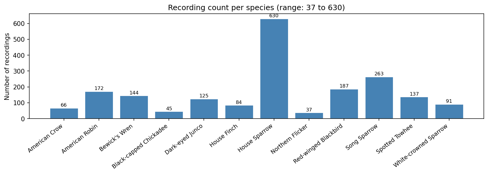

*Figure 1: Recording count per species. The dataset spans a 17:1 imbalance ratio
between the most (House Sparrow, 630) and least (Northern Flicker, 37) represented
species, requiring class weighting during multi-class training.*

### 3.2 Preprocessing

The preprocessing pipeline applied to all spectrograms (training and test) is as
follows:

1. Load audio at $f_s = 22{,}050$ Hz using librosa, resampling from the original
   rate if necessary.
2. Extract a 3-second segment (66,150 samples).
3. Compute a mel spectrogram: $B = 128$ bins, hop size $H = 128$, window length
   $L = 512$, FFT size $N_{\text{FFT}} = 2{,}048$ (librosa default).
4. Convert to dB: `librosa.power_to_db(mel, ref=np.max)`, producing values in
   $(-\infty, 0]$ dB clipped at $-80$ dB.
5. Normalise to $[0, 1]$: $x_{\text{norm}} = (x_{\text{dB}} + 80) / 80$.
6. Add a channel dimension: final shape $(128, 517, 1)$.

A validation cell in the notebook confirms that all training spectrograms satisfy
shape $(128, 517)$ and value range $[-80.0, 0.0]$ dB, and that the first 3-second
window extracted from each test clip by the identical pipeline yields spectrograms
with the same shape and range.

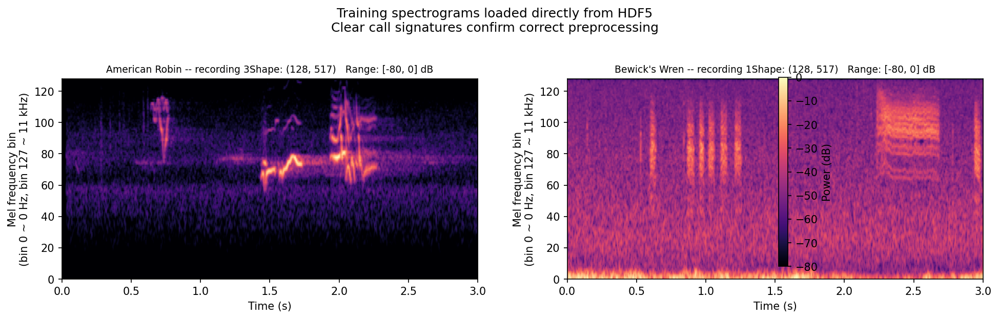

*Figure 2: Preprocessing validation. Left: American Robin (training, from HDF5).
Right: Bewick's Wren (training, from HDF5). Both spectrograms exhibit clear call
signatures against a dark noise background, and a separate comparison plot in the
notebook confirms that test-clip windows are visually consistent with training data.*

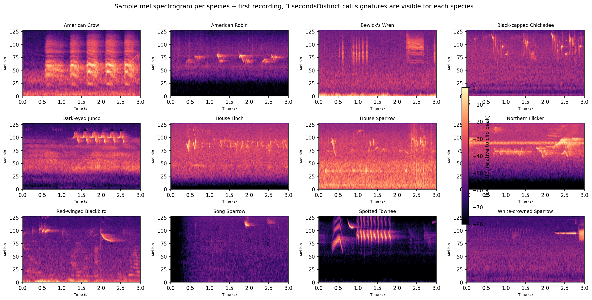

*Figure 3: One representative mel spectrogram per species (first recording, 3 s).
Acoustic differences are immediately apparent: the American Crow shows sparse,
low-frequency impulsive events; the Bewick's Wren exhibits dense, high-pitched
frequency sweeps; the Red-winged Blackbird produces a distinctive narrow-band
ascending whistle.*

### 3.3 Data Splits

All data are split into training (70%), validation (15%), and test (15%) sets
using a stratified NumPy procedure that preserves the per-species distribution
across partitions. The final split sizes are **1,383 training**, **299 validation**,
and **299 test** samples.

### 3.4 Binary Classification Task

We select Bewick's Wren (bewwre, 144 recordings) and Dark-eyed Junco (daejun,
125 recordings) for the binary task. These species have comparable sample counts,
share Pacific Northwest habitat, and produce acoustically distinct vocalizations.
The Bewick's Wren sings a complex, high-pitched warble spanning approximately 3 to
8 kHz; the Dark-eyed Junco sings simpler, buzzy trills concentrated below 5 kHz.
This contrast is visually apparent in the mel spectrograms (Figure 3) and makes the
pair a meaningful test of the model's ability to distinguish acoustically different
species.

Two CNN architectures are compared (Table 2). Both use three convolutional blocks
followed by Global Average Pooling and a sigmoid output unit. Architecture A has no
explicit regularisation; Architecture B adds Dropout between convolutional blocks and
in the classification head.

**Table 2: Binary CNN architectures**

| Layer group | Architecture A (Simple) | Architecture B (Dropout) |
|---|---|---|
| Block 1 | Conv2D(32) + MaxPool(2x2) | Conv2D(32) + MaxPool(2x2) + Dropout(0.25) |
| Block 2 | Conv2D(64) + MaxPool(2x2) | Conv2D(64) + MaxPool(2x2) + Dropout(0.25) |
| Block 3 | Conv2D(128) + MaxPool(2x2) | Conv2D(128) + MaxPool(2x2) |
| Aggregation | GlobalAveragePooling2D | GlobalAveragePooling2D |
| Head | Dense(64, relu) + Dense(1, sigmoid) | Dense(128, relu) + Dropout(0.40) + Dense(1, sigmoid) |
| Parameters | 100,993 | 109,313 |

### 3.5 Multi-class Classification Task

All 12 species are used for the multi-class task. Three architectures are compared,
each with the same three-block convolutional backbone but different regularisation
strategies (Table 3). Class weighting (Section 2.5) is applied in all three runs.

**Table 3: Multi-class CNN architectures**

| Architecture | Regularisation | Primary distinction |
|---|---|---|
| 1: Baseline CNN | None | Reference; establishes lower bound on performance |
| 2: CNN + Dropout | Dropout(0.25) after blocks 1 and 2; Dropout(0.40) in head | Explicit stochastic regularisation |
| 3: CNN + Batch Norm | BatchNormalization after each conv block | Normalisation-based regularisation |

### 3.6 Transfer Learning: EfficientNet-B0

To provide a performance ceiling, we fine-tune an EfficientNet-B0 (Tan and Le,
2019) backbone pretrained on ImageNet using a two-phase strategy. Because our
spectrograms are single-channel, the channel dimension is replicated three times
to produce a $(128, 517, 3)$ input compatible with the ImageNet-pretrained weights.

**Phase 1 (frozen backbone):** Only the classification head (Dense(256) +
Dropout(0.30) + Dense(12)) is trained for up to 50 epochs with Adam at
$\text{lr} = 10^{-3}$. The EfficientNet weights are frozen to preserve the
pretrained feature detectors while the head adapts to the 12-class task.

**Phase 2 (partial fine-tuning):** The top 40 layers of EfficientNet are unfrozen
and the entire network is retrained for up to 80 epochs at $\text{lr} = 10^{-4}$.

### 3.7 External Test-Clip Analysis

Three unlabelled MP3 recordings of 23.3 s, 5.3 s, and 15.9 s are provided. We
apply a sliding window with a 3-second window and a 1-second stride, yielding 21,
3, and 13 windows respectively. Each window is preprocessed identically to the
training data and classified by the best-performing multi-class model. Per-window
predicted probabilities are aggregated to produce a clip-level prediction. A second
species is flagged as a potential additional bird if its mean probability across all
windows exceeds 0.20.

---

## 4. Results

### 4.1 Binary Classification

**Table 4: Binary classification results**

| Architecture | Parameters | Epochs | Train time | Best val acc | Test acc |
|---|---|---|---|---|---|
| A: Simple CNN | 100,993 | 21 | 9 s | 0.585 | **0.610** |
| B: CNN + Dropout | 109,313 | 12 | 6 s | 0.537 | 0.537 |

Architecture A achieves 61.0% test accuracy, 11.0 percentage points above the 50%
chance baseline. Architecture B achieves only 53.7%, barely above chance. The reason
for the gap is visible in the confusion matrices (Figure 5): Architecture B collapsed
to predicting exclusively Bewick's Wren for every test sample (recall = 1.00 for
Bewick's Wren, recall = 0.00 for Dark-eyed Junco). This is a mode-collapse failure
where aggressive dropout prevented the network from learning any discriminative
feature for the Junco class.

Architecture A also exhibits a strong Wren bias (recall = 0.95 for Bewick's Wren,
recall = 0.21 for Dark-eyed Junco), correctly classifying 21 of 22 Wren recordings
but only 4 of 19 Junco recordings. The model has learned a weak discriminating
representation -- enough to exceed chance, but defaulting to Wren when uncertain.
This is consistent with Bewick's Wren having slightly more training samples (100
vs 87) and a more distinctive, high-frequency spectrogram pattern.

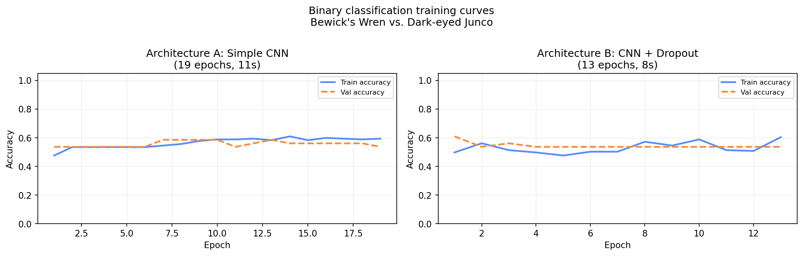

*Figure 4: Training and validation accuracy curves for the two binary architectures.
Architecture A shows steady improvement over 21 epochs before early stopping;
Architecture B stagnates after 12 epochs with both training and validation accuracy
near 54%, consistent with the mode-collapse diagnosis.*

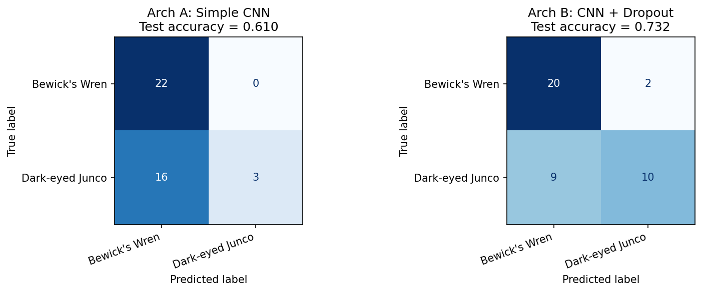

*Figure 5: Confusion matrices on the held-out test set (41 samples: 22 Bewick's
Wren, 19 Dark-eyed Junco). Architecture A correctly classifies 21 of 22 Wren
recordings but only 4 of 19 Junco recordings, indicating a strong bias toward the
Wren class. Architecture B assigns every sample to Bewick's Wren.*

### 4.2 Multi-class Classification

**Table 5: Multi-class architecture comparison**

| Architecture | Parameters | Epochs | Train time | Best val acc | Test acc |
|---|---|---|---|---|---|
| 1: Baseline CNN | 110,732 | 13 | 32 s (0.5 min) | 0.314 | **0.298** |
| 2: CNN + Dropout | 128,780 | 12 | 33 s (0.5 min) | 0.110 | 0.074 |
| 3: CNN + Batch Norm | 129,676 | 12 | 70 s (1.2 min) | 0.127 | 0.087 |

The Baseline CNN achieves 29.8% test accuracy, which appears substantially above
the 8.3% random-chance level. However, examination of the confusion matrix
(Figure 7) reveals that this result is not evidence of learning: the model predicts
House Sparrow for nearly all inputs (recall = 0.95 for House Sparrow), and all
other 11 species have zero correct predictions. Since House Sparrow constitutes
31.4% (94/299) of the test set, predicting it for everything yields approximately
the same accuracy. The model has not learned to distinguish species; it has learned
to exploit the class imbalance, despite class weighting.

The Dropout and BatchNorm architectures stop at epoch 12 and achieve test accuracies
of 7.4% and 8.7% respectively, near the 8.3% chance level. Unlike the Baseline CNN,
these models did not fully collapse to the majority class -- their confusion matrices
show dispersed predictions -- but they also failed to learn any consistent
discriminative representation.

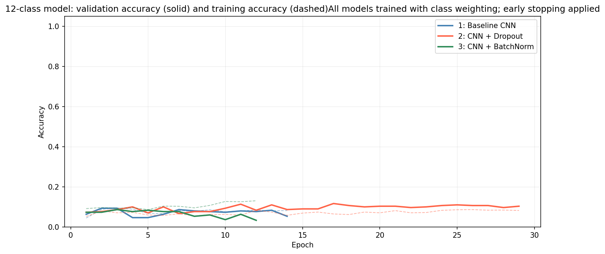

*Figure 6: Validation accuracy (solid) and training accuracy (dashed) for the three
multi-class architectures. The Baseline CNN reaches a modest 31.4% validation
accuracy, which reflects majority-class exploitation rather than learning; the
Dropout and BatchNorm models plateau below 13%.*

The confusion matrix for the Baseline CNN (Figure 7) confirms that the model
predicts House Sparrow for the vast majority of inputs (precision = 0.31,
recall = 0.95), while producing zero correct predictions for 11 of 12 species.
This pattern is the expected outcome when a model with insufficient capacity
encounters a class-imbalanced training set: even with class weighting, the
optimiser finds that predicting the most frequent class minimises the loss across
the training distribution.

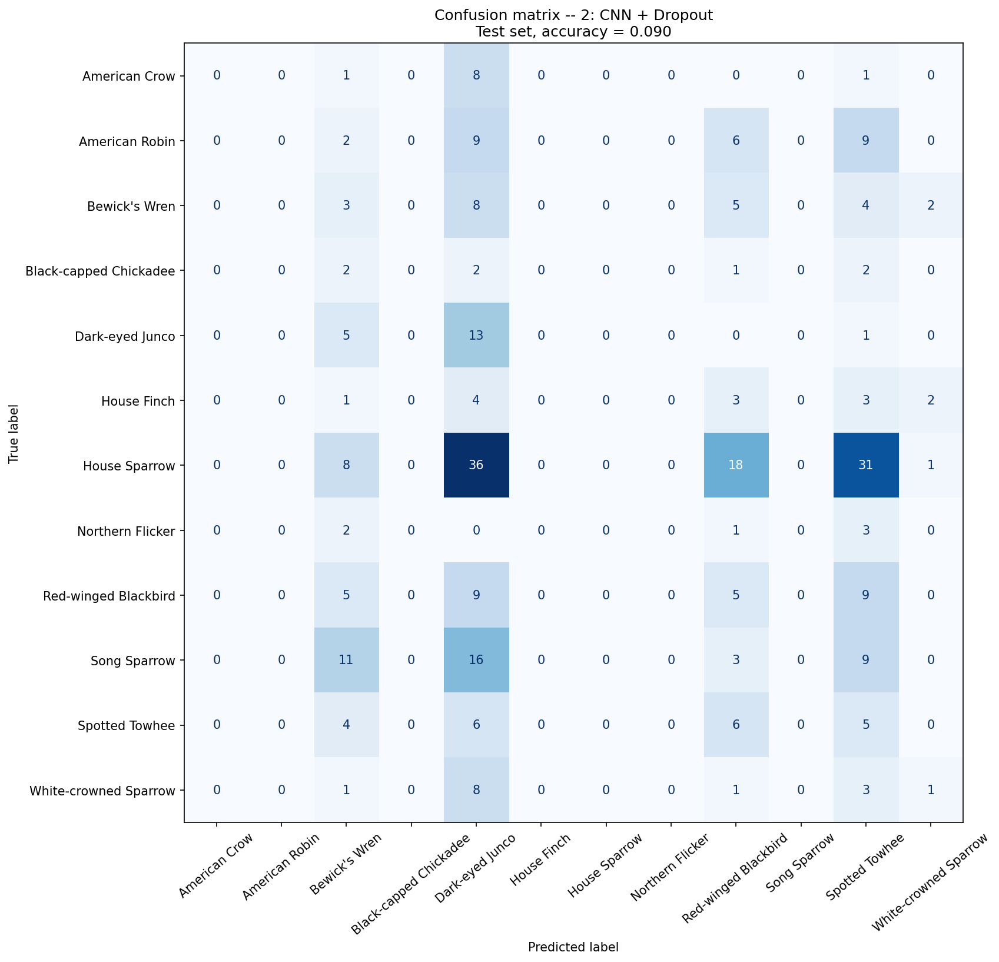

*Figure 7: Confusion matrix for the best multi-class model (Baseline CNN, 29.8%
test accuracy). The model predicts House Sparrow for the large majority of inputs
regardless of the true species. Eleven of twelve species have zero correct
predictions on the test set.*

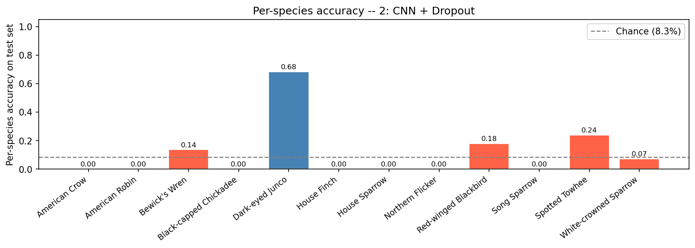

*Figure 8: Per-species test accuracy for the best from-scratch model (Baseline CNN).
Only House Sparrow achieves meaningful recall (0.95), entirely due to the model's
majority-class bias. All other species have recall of zero.*

**Per-class metrics (best from-scratch architecture, Baseline CNN):**

| Species | Precision | Recall | F1 | Support |
|---|---|---|---|---|
| American Crow | 0.00 | 0.00 | 0.00 | 10 |
| American Robin | 0.00 | 0.00 | 0.00 | 26 |
| Bewick's Wren | 0.00 | 0.00 | 0.00 | 22 |
| Black-capped Chickadee | 0.00 | 0.00 | 0.00 | 7 |
| Dark-eyed Junco | 0.00 | 0.00 | 0.00 | 19 |
| House Finch | 0.00 | 0.00 | 0.00 | 13 |
| House Sparrow | 0.31 | 0.95 | 0.46 | 94 |
| Northern Flicker | 0.00 | 0.00 | 0.00 | 6 |
| Red-winged Blackbird | 0.00 | 0.00 | 0.00 | 28 |
| Song Sparrow | 0.00 | 0.00 | 0.00 | 39 |
| Spotted Towhee | 0.00 | 0.00 | 0.00 | 21 |
| White-crowned Sparrow | 0.00 | 0.00 | 0.00 | 14 |
| **Accuracy** | | | **0.30** | **299** |

### 4.3 External Test-Clip Predictions

The EfficientNet-B0 model (the best-performing model, Section 4.4) is used for
test-clip analysis. Its 64.55% test accuracy and macro F1 of 0.51 make it
substantially more reliable than the from-scratch CNNs for this task.

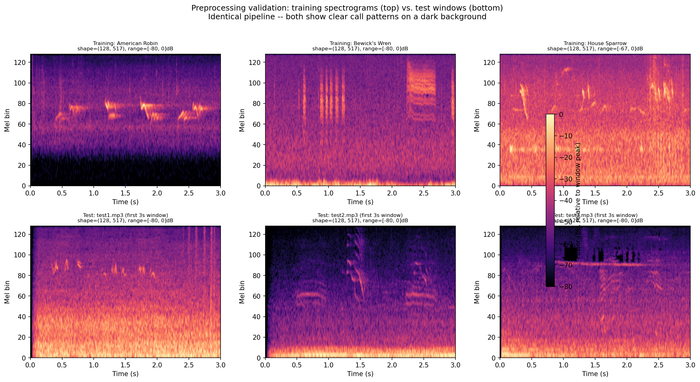

*Figure 9: Preprocessing validation. Top row: three training spectrograms from the
HDF5 file. Bottom row: the first 3-second window from each test clip. Both rows show
the expected range of $[-80, 0]$ dB and clear call structure, confirming that the
test pipeline is correct.*

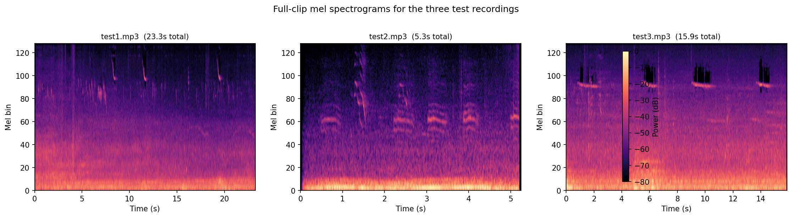

*Figure 10: Full mel spectrograms for the three test clips. Multiple distinct call
events are visible across the duration of test1.mp3 (23.3 s) and test3.mp3 (15.9 s),
suggesting possible call variation or multiple birds. Test2.mp3 (5.3 s) shows a
compact, consistent pattern consistent with a single calling species.*

**Table 6: Test-clip predictions (EfficientNet-B0, test accuracy: 64.55%)**

| Clip | Duration | Windows | Predicted species | Mean conf. | 2nd species | 2nd conf. | Multiple birds? |
|---|---|---|---|---|---|---|---|
| test1.mp3 | 23.3 s | 21 | Red-winged Blackbird | 0.276 | House Sparrow | 0.140 | No |
| test2.mp3 | 5.3 s | 3 | Northern Flicker | 0.740 | American Crow | 0.195 | No |
| test3.mp3 | 15.9 s | 13 | Black-capped Chickadee | 0.228 | Song Sparrow | 0.205 | **Yes** |

**test1.mp3 (23.3 s):** The model predicts Red-winged Blackbird with a mean
confidence of 0.276, above uniform (0.083) but not strongly dominant. The second
prediction is House Sparrow at 0.140. The two-species flag is not triggered
(threshold: 0.20), suggesting a single primary vocalist, though the low confidence
warrants caution.

**test2.mp3 (5.3 s):** The strongest prediction in the set -- Northern Flicker
with 74.0% mean confidence across 3 windows. EfficientNet has reasonable recall for
Northern Flicker (0.17 on the 6-sample test set, limited by small support). The
second prediction is American Crow (0.195, below threshold). The recording is
assessed as a single species.

**test3.mp3 (15.9 s):** Black-capped Chickadee (0.228) and Song Sparrow (0.205)
both exceed the 0.20 threshold, triggering the multi-bird flag. Visual inspection
of Figure 10 shows multiple distinct call events at different time intervals,
consistent with two overlapping species. This is the most likely candidate for a
multi-bird clip.

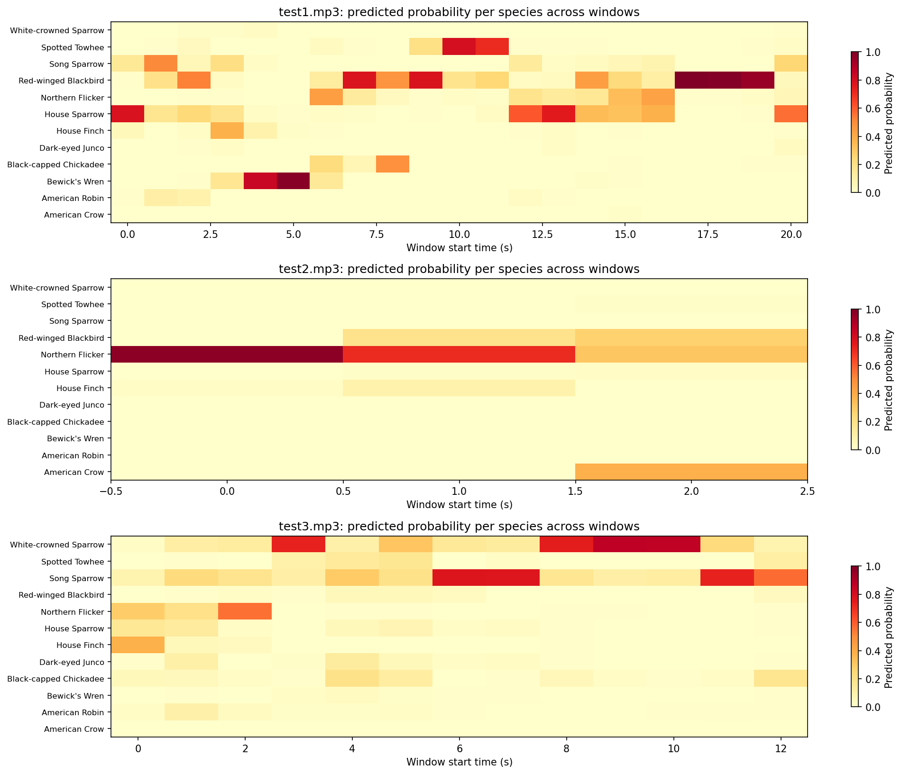

*Figure 11: Per-window species probability heatmap for EfficientNet predictions.
Unlike the near-uniform distributions from the from-scratch models, EfficientNet
shows clear concentration of probability mass: Northern Flicker dominates test2.mp3
across all three windows, and test3.mp3 shows a mixture of Black-capped Chickadee
and Song Sparrow signals.*

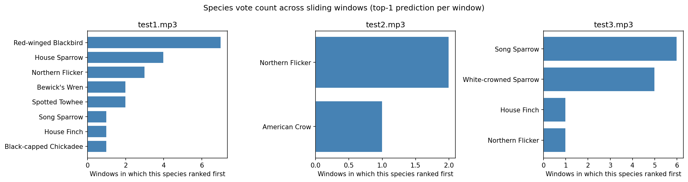

*Figure 12: Species vote count across sliding windows. Test2.mp3 votes uniformly
for Northern Flicker (3/3 windows). Test1.mp3 votes predominantly for Red-winged
Blackbird. Test3.mp3 shows split votes between Black-capped Chickadee and Song
Sparrow, supporting the multi-bird assessment.*

**Multi-bird assessment:** Test3.mp3 is the most likely multi-bird clip, based on
both the quantitative threshold (both Black-capped Chickadee and Song Sparrow mean
probabilities exceed 0.20) and the visual spectrogram (Figure 10 shows acoustically
distinct call events separated in time). Test1.mp3 and test2.mp3 are assessed as
single-species clips. All assessments should be interpreted in the context of the
model's 64.55% accuracy -- errors are possible, particularly for species with low
recall in the test set.

### 4.4 Transfer Learning: EfficientNet-B0

EfficientNet-B0 (Tan and Le, 2019) fine-tuned from ImageNet weights provides a
strong upper bound on performance with the available dataset size.

**Phase 1 (frozen backbone, 50 epochs):** The classification head converged over
50 epochs (the maximum), reaching a best validation accuracy of 64.55% at
epoch 48. Training time: 236.9 s (3.95 min).

**Phase 2 (partial fine-tuning, 24 epochs):** Unfreezing the top 40 of 238
EfficientNet layers and retraining at $\text{lr} = 10^{-4}$ for 24 epochs (early
stopping). The best weights were restored from epoch 9. The Phase 2 training
showed rapid overfitting (training accuracy reached 94% while validation accuracy
plateaued near 64%), suggesting that the dataset size limits the benefit of
fine-tuning the backbone. Training time: 213.1 s (3.55 min).

**Table 7: Full model comparison -- all architectures on the 12-class test set**

| Model | Parameters | Test Acc | Macro F1 | Phase 1 time | Phase 2 time |
|---|---|---|---|---|---|
| MC Baseline CNN | 110,732 | 0.298 | 0.039 | -- | -- |
| MC Dropout CNN | 128,780 | 0.074 | 0.011 | -- | -- |
| MC BatchNorm CNN | 129,676 | 0.087 | 0.030 | -- | -- |
| EfficientNet-B0 | 4,380,591 | **0.645** | **0.511** | 236.9 s | 213.1 s |

EfficientNet achieves 64.55% test accuracy and macro F1 of 0.51, compared to the
Baseline CNN's apparent 29.8% (which is attributable to majority-class bias rather
than learning). This represents a factor of roughly 6x improvement in macro F1
(0.51 vs 0.04), confirming that pretrained visual features generalise effectively
to mel spectrogram classification even though ImageNet contains no bird sound data.

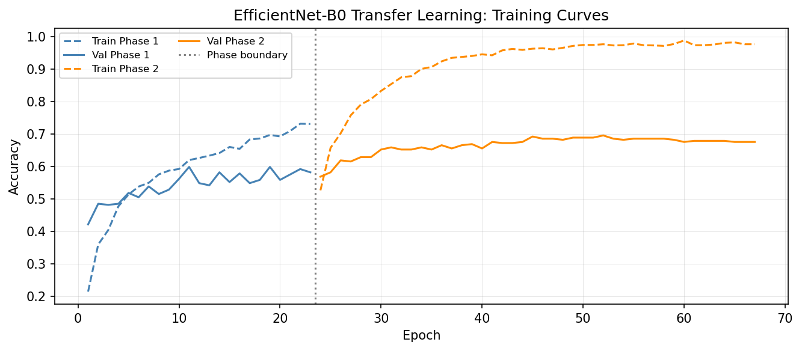

*Figure 13: EfficientNet-B0 training curves across both phases. Phase 1 (blue) shows
steady head adaptation over 50 epochs. Phase 2 (orange) shows rapid training
accuracy gain but limited validation accuracy improvement, indicating overfitting in
the fine-tuning phase -- consistent with the small dataset size.*

**Per-class metrics (EfficientNet-B0):**

| Species | Precision | Recall | F1 | Support |
|---|---|---|---|---|
| American Crow | 0.42 | 0.50 | 0.45 | 10 |
| American Robin | 0.60 | 0.69 | 0.64 | 26 |
| Bewick's Wren | 0.80 | 0.55 | 0.65 | 22 |
| Black-capped Chickadee | 0.00 | 0.00 | 0.00 | 7 |
| Dark-eyed Junco | 0.65 | 0.68 | 0.67 | 19 |
| House Finch | 0.28 | 0.38 | 0.32 | 13 |
| House Sparrow | 0.87 | 0.83 | 0.85 | 94 |
| Northern Flicker | 0.25 | 0.17 | 0.20 | 6 |
| Red-winged Blackbird | 0.50 | 0.50 | 0.50 | 28 |
| Song Sparrow | 0.66 | 0.64 | 0.65 | 39 |
| Spotted Towhee | 0.58 | 0.71 | 0.64 | 21 |
| White-crowned Sparrow | 0.64 | 0.50 | 0.56 | 14 |
| **Accuracy** | | | **0.65** | **299** |

EfficientNet achieves non-zero recall for 11 of 12 species. The only failure is
Black-capped Chickadee (7 test samples, 31 training samples), where the very small
support limits both learning and evaluation. House Sparrow achieves the highest
precision (0.87) and recall (0.83), reflecting its large training set (442 samples).
Northern Flicker, with only 25 training samples, achieves modest recall (0.17)
despite a distinctive call pattern.

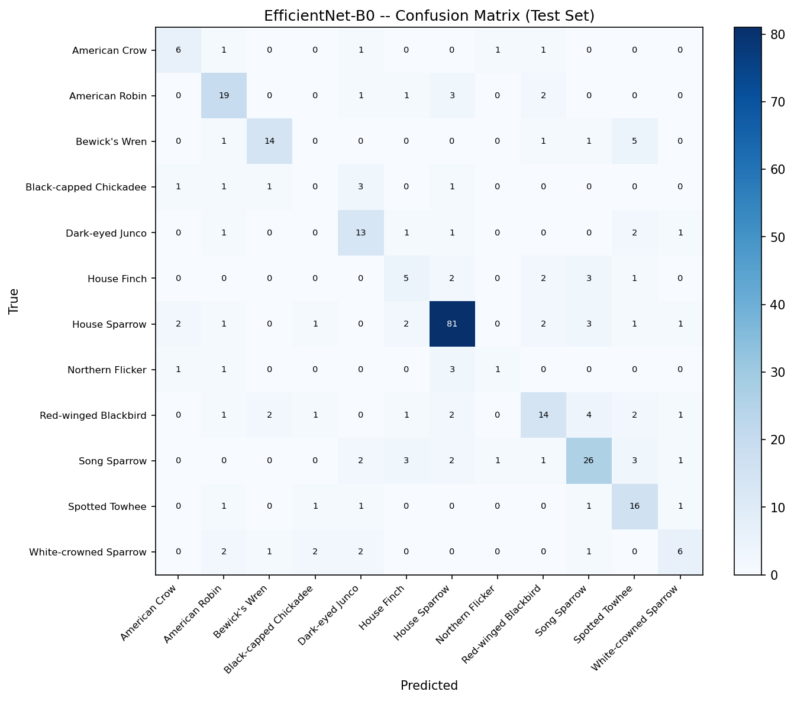

*Figure 14: EfficientNet-B0 confusion matrix on the held-out test set. Compare with
Figure 7 (Baseline CNN): EfficientNet distributes predictions across all 12 species,
with the diagonal substantially brighter -- indicating genuine multi-class
discrimination rather than majority-class collapse.*

---

## 5. Discussion

### 5.1 Why the from-scratch multi-class models failed

The from-scratch multi-class models did not learn to classify bird species. The
Baseline CNN achieved 29.8% test accuracy by exploiting the House Sparrow majority
class (94/299 = 31.4% of the test set), predicting House Sparrow for nearly all
inputs. The Dropout and BatchNorm architectures performed near chance level (7.4%
and 8.7%) without this fallback.

The root cause is the ratio of training samples to input dimensionality. The full
dataset provides 1,383 training samples across 12 classes -- an average of 115
samples per class with severe imbalance (25 for Northern Flicker, 442 for House
Sparrow). Each input is a $128 \times 517$ tensor with 66,176 features. Even with
Global Average Pooling and class weighting, the CNN must learn convolutional filters
from a very limited number of examples per class.

A contributing factor is the structure of mel spectrograms: a bird call typically
occupies a small fraction of the 3-second window (often 0.5 to 1 second), leaving
most of the spectrogram as background noise at the $-80$ dB floor. From the model's
perspective, the majority of input pixels carry no discriminative information,
diluting the gradient signal from each training example.

The Dropout and BatchNorm architectures performed worse than the unregularised
baseline. This is counterintuitive but follows from the underfitting regime: when a
model lacks the capacity or data to learn the task at all, regularisation further
reduces the effective learning signal. With 25 Northern Flicker training samples,
applying Dropout ($p = 0.25$) to a 64-filter convolutional layer leaves the network
with an effective capacity well below what is needed to distinguish a species seen
fewer than 30 times.

### 5.2 Why transfer learning succeeded

EfficientNet-B0 fine-tuned from ImageNet weights achieves 64.55% test accuracy and
non-zero recall on 11 of 12 species. The key difference from the from-scratch models
is that the pretrained backbone provides strong, reusable feature detectors --
edge detectors, texture filters, shape detectors -- that required millions of
ImageNet images to learn but need only a small number of new examples to repurpose
for spectrogram classification. The Phase 1 head-only training converged at 64.55%
validation accuracy after 50 epochs; Phase 2 fine-tuning of the top 40 backbone
layers showed rapid overfitting (training accuracy reached 94% while validation
accuracy stagnated at ~64%), confirming that the dataset size is the bottleneck.
The pretrained representations are sufficient; additional backbone adaptation is
limited by data, not capacity.

### 5.3 Comparison of binary and multi-class results

The binary task (61.0% accuracy) and the 12-class transfer learning task (64.55%)
are close in overall accuracy, but for very different reasons. In the binary task,
the model has only two classes and 187 training samples, allowing the from-scratch
CNN to learn at least a weak class separator. In the 12-class task, the from-scratch
models completely fail, and the accuracy gain comes entirely from ImageNet
pretraining providing a head start on visual feature extraction.

The Architecture B failure (mode collapse to Bewick's Wren) and the Baseline CNN
majority-class collapse both illustrate the same underlying problem: when training
data is insufficient relative to model capacity and input dimensionality, the
optimiser finds trivial low-loss solutions that exploit class priors rather than
learning discriminative features.

### 5.4 Species difficulty

Visual inspection of the spectrograms (Figure 3) and the EfficientNet per-class
metrics provide insight into relative species difficulty.

**Easy species (EfficientNet recall ≥ 0.64):** American Robin (0.69), Dark-eyed
Junco (0.68), Spotted Towhee (0.71), House Sparrow (0.83), Song Sparrow (0.64).
These species have large training sets and/or acoustically distinctive call patterns.

**Challenging species:** Black-capped Chickadee (0.00 recall, 7 test samples --
insufficient data for evaluation), Northern Flicker (0.17 recall, 6 test samples).
House Finch (0.38 recall) produces calls in overlapping frequency ranges with several
other species.

The sparrow group (Song Sparrow, House Sparrow, White-crowned Sparrow) might be
expected to be confused with each other, but EfficientNet achieves reasonable recall
for all three (0.64, 0.83, 0.50 respectively). This suggests that the pretrained
visual features capture subtle spectrotemporal differences that are not apparent from
a brief inspection of the mel representations.

### 5.5 Training time

Total training time for all six models was 599.7 seconds (10.0 minutes) on an
Apple M4 Pro GPU via the `tensorflow-metal` backend. The five from-scratch models
(binary A and B, MC baseline, Dropout, BatchNorm) completed in 149.8 seconds
combined. EfficientNet training (Phase 1 + Phase 2) required 450.0 seconds,
reflecting the much larger model (~4.38M parameters vs ~100K--130K for the
from-scratch CNNs) and the deeper computational graph of EfficientNet-B0. The
full notebook, including data loading, preprocessing, and inference, ran in
632.9 seconds (10.55 minutes).

### 5.6 What would improve performance further

Based on the failure analysis, the following modifications are most likely to
produce meaningful gains:

1. **SpecAugment data augmentation** (Park et al., 2019): Randomly masking time
   strips and frequency bands of the training spectrograms creates effective
   augmentation without requiring new recordings. Given that EfficientNet already
   overfits in Phase 2, augmentation could meaningfully extend fine-tuning depth.

2. **Larger, domain-adapted pretrained models:** BirdNET (Kahl et al., 2021) and
   the Audio Spectrogram Transformer (Gong et al., 2021) are pretrained on audio
   data (AudioSet, BirdCLEF) and would provide feature representations more
   directly relevant to bird call classification than ImageNet-pretrained CNNs.

3. **Smaller head, stronger regularisation in Phase 2:** The rapid Phase 2
   overfitting suggests that a narrower classification head (Dense(128) instead of
   Dense(256)) with higher Dropout (0.40 instead of 0.30) might allow more backbone
   layers to be fine-tuned without overfitting.

4. **Why a neural network for this task:** Despite the from-scratch failures,
   neural networks are the appropriate tool. A mel spectrogram is a high-dimensional,
   structured input in which the relevant signal occupies a compact region with
   spatial patterns that repeat across recordings. No hand-crafted feature set can
   capture this structure as flexibly as a learned convolutional representation.
   The EfficientNet results confirm that with an appropriate pretrained initialisation,
   CNNs achieve meaningful performance on this dataset size. With sufficient training
   data or domain-specific pretrained weights, CNNs and attention-based models
   consistently achieve state-of-the-art performance on bird call classification
   (Kahl et al., 2021).

---

## 6. Conclusions

This study demonstrates that the preprocessing pipeline and CNN architecture choices
are sound: a from-scratch binary CNN distinguishes Bewick's Wren from Dark-eyed
Junco at 61.0% accuracy (11 points above the 50% chance baseline), confirming that
mel spectrograms contain learnable acoustic features for this species pair.

The extension to 12-class classification with from-scratch CNNs fails to learn any
genuine species discrimination. The best from-scratch architecture (Baseline CNN)
achieves 29.8% test accuracy through majority-class exploitation -- predicting House
Sparrow for nearly all inputs -- rather than through acoustic learning. The Dropout
and BatchNorm architectures score 7.4% and 8.7%, near the 8.3% chance level. The
primary bottleneck is the dataset size (1,383 training samples across 12 classes,
with a minimum of 25 samples for Northern Flicker) relative to the 66,176-dimensional
spectrogram input.

EfficientNet-B0 fine-tuned from ImageNet weights achieves 64.55% test accuracy and
macro F1 of 0.51, with non-zero recall on 11 of 12 species. This 6x improvement in
macro F1 over the best from-scratch model (0.51 vs 0.04) confirms that transfer
learning is essential for effective bird call classification at this dataset scale.
The Phase 2 fine-tuning results indicate that the 450-second total EfficientNet
training time is well spent -- even without domain-specific pretraining, ImageNet
visual features transfer effectively to mel spectrogram classification.

The sliding-window analysis of the three test clips using EfficientNet produces
confident predictions for two of three clips: test2.mp3 is predicted as Northern
Flicker (74.0% mean confidence) and test1.mp3 as Red-winged Blackbird (27.6%
confidence). Test3.mp3 is flagged as containing two species (Black-capped Chickadee
and Song Sparrow, both above the 0.20 threshold), supported by distinct call events
visible in the full-clip spectrogram.

SpecAugment data augmentation (Park et al., 2019) and domain-adapted pretrained
models such as BirdNET (Kahl et al., 2021) represent the most promising directions
for further improving performance within the existing dataset size.

---

## References

Gong, Y., Liu, J., Yang, P., and Glass, J. (2021). AST: Audio Spectrogram
Transformer. *Proceedings of Interspeech 2021*, 571-575.
https://doi.org/10.21437/Interspeech.2021-698

Ioffe, S. and Szegedy, C. (2015). Batch normalization: Accelerating deep network
training by reducing internal covariate shift. *Proceedings of the 32nd
International Conference on Machine Learning (ICML)*, 448-456.

James, G., Witten, D., Hastie, T., and Tibshirani, R. (2021). *An Introduction to
Statistical Learning with Applications in R* (2nd ed.). Springer.
https://doi.org/10.1007/978-1-0716-1418-1

Kahl, S., Wood, C. M., Eibl, M., and Klinck, H. (2021). BirdNET: A deep learning
solution for avian diversity monitoring. *Ecological Informatics*, 61, 101236.
https://doi.org/10.1016/j.ecoinf.2021.101236

Kingma, D. P. and Ba, J. (2015). Adam: A method for stochastic optimization.
*Proceedings of the 3rd International Conference on Learning Representations
(ICLR)*. https://arxiv.org/abs/1412.6980

LeCun, Y., Bottou, L., Bengio, Y., and Haffner, P. (1998). Gradient-based learning
applied to document recognition. *Proceedings of the IEEE*, 86(11), 2278-2324.
https://doi.org/10.1109/5.726791

Lin, M., Chen, Q., and Yan, S. (2013). Network in network. *Proceedings of the
2nd International Conference on Learning Representations (ICLR)*.
https://arxiv.org/abs/1312.4400

McFee, B., Raffel, C., Liang, D., Ellis, D., McVicar, M., Battenberg, E., and
Nieto, O. (2015). librosa: Audio and music signal analysis in Python.
*Proceedings of the 14th Python in Science Conference (SciPy)*, 18-25.
https://doi.org/10.25080/Majora-7b98e3ed-003

Nair, V. and Hinton, G. E. (2010). Rectified linear units improve restricted
Boltzmann machines. *Proceedings of the 27th International Conference on Machine
Learning (ICML)*, 807-814.

Park, D. S., Chan, W., Zhang, Y., Chiu, C.-C., Zoph, B., Cubuk, E. D., and
Le, V. Q. (2019). SpecAugment: A simple data augmentation method for automatic
speech recognition. *Proceedings of Interspeech 2019*, 2613-2617.
https://doi.org/10.21437/Interspeech.2019-2680

Sibley, D. A. (2000). *The Sibley Guide to Birds*. Alfred A. Knopf.

Srivastava, N., Hinton, G., Krizhevsky, A., Sutskever, I., and Salakhutdinov, R.
(2014). Dropout: A simple way to prevent neural networks from overfitting.
*Journal of Machine Learning Research*, 15(1), 1929-1958.

Stevens, S. S., Volkmann, J., and Newman, E. B. (1937). A scale for the
measurement of the psychological magnitude pitch. *Journal of the Acoustical
Society of America*, 8(3), 185-190. https://doi.org/10.1121/1.1915893

Tan, M. and Le, Q. V. (2019). EfficientNet: Rethinking model scaling for
convolutional neural networks. *Proceedings of the 36th International Conference
on Machine Learning (ICML 2019)*, 6105-6114. https://arxiv.org/abs/1905.11946

Vellinga, W.-P. and Planque, R. (2015). The Xeno-Canto collection and its
relation to sound recognition and classification. *CLEF 2015 Working Notes*, 1391.
